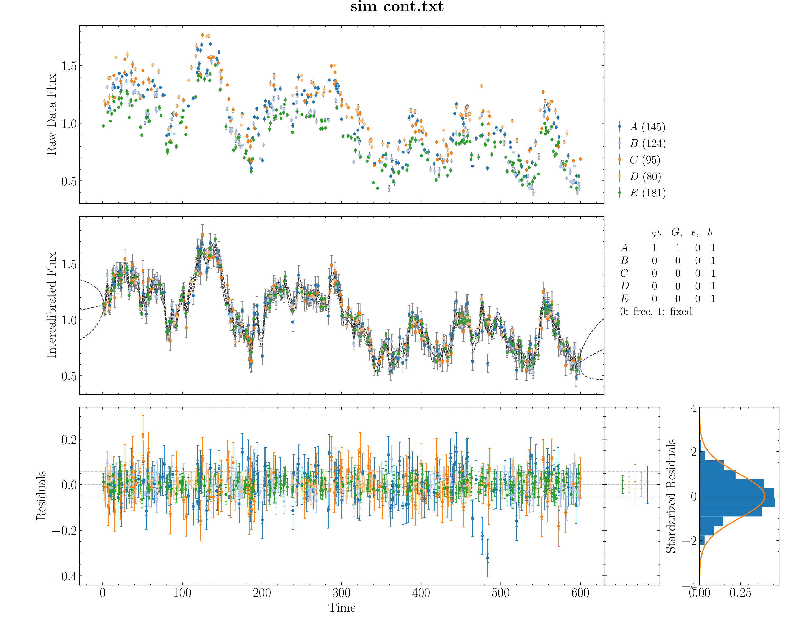
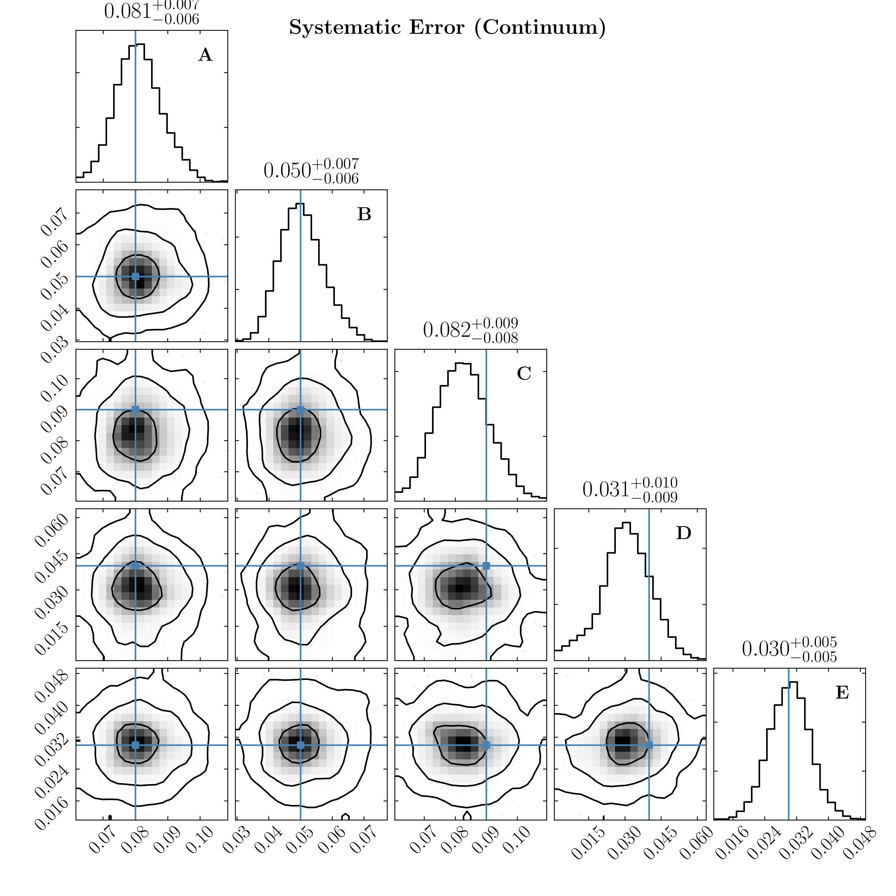

*******
Tests
*******

A mock light curve is generated using the damped random walk model and then passed to pyCALI. 
The obtained estimates for scale factors, shift factors, and systematic errors are consistent 
with the input values.

  
  A mock light curve with five datasets and the intercalibration.

  
  The obtained posterior distributions of the systematic error factors. Blue lines represent the input values.
