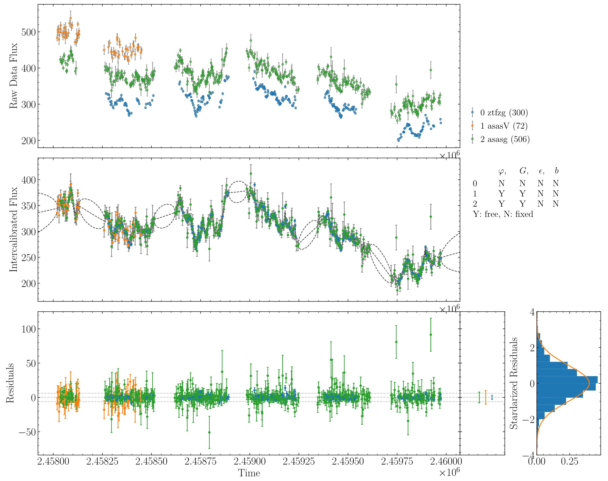
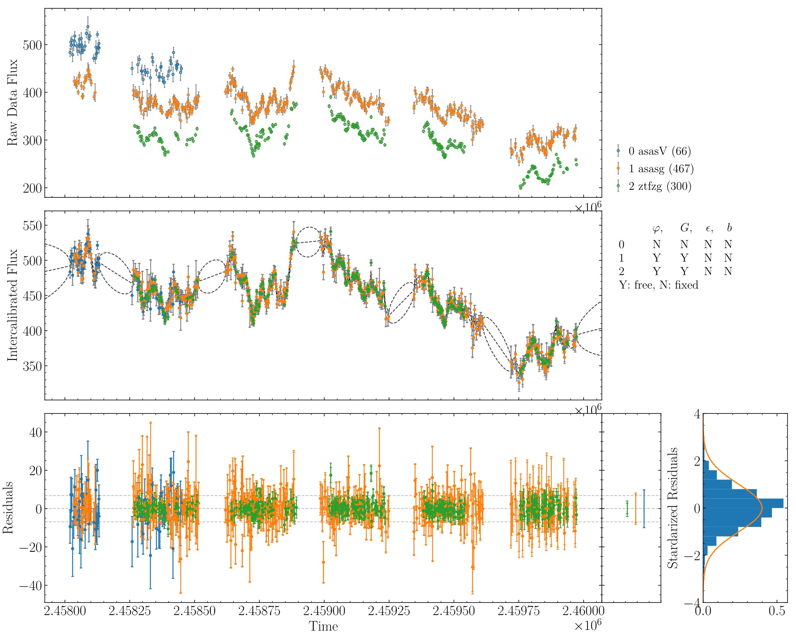

**********************
An Exemplary Tutorial
**********************

Here is a detailed tutorial to show how to use PyCALI in Python 
by taking the data of Mrk 335 from ASAS-SN and ZTF as an example.

A jupyter notebook "tests_mrk335.jpynb" and a Python script "tests_mrk335.py" are 
provided in the folder "tests/" along with the package. The relevant data 
"Mrk335_ztf.csv" and "Mrk335_asas.csv" are also provided in the same folder.

First download the data of Mrk 335 in a CSV format from ASAS-SN website 
(https://asas-sn.osu.edu/)
and ZTF website (ZTF g band; https://irsa.ipac.caltech.edu/Missions/ztf.html). 
Suppose the filenames are Mrk335_asas.csv and Mrk335_ztf.csv, respectively.

Load these data and generate a formatted input file for PyCALI.

.. code-block:: python
    
    import numpy as np 
    import matplotlib.pyplot as plt 
    import pycali

    ztf = pycali.convert_ztf("Mrk335_ztf.csv", rebin=True, errlimit=0.079, zeropoint=3.92e-9)
    # rebin:  whether rebin the points within one day
    # errlimit: discard these points with errors larger than this limit
    # unit is the zero-magnitude flux density
    # return a dict
    
    asas = pycali.convert_asassn("Mrk335_asas.csv", rebin=True, errlimit=0.079, diffcamera=False, zeropoint=3.92e-9)
    # diffcamera: whether treat different cameras as different datasets
    
    data = ztf | asassn  # combine the two dicts
    
    # write to a file named "Mrk335.txt"
    pycali.format("Mrk335.txt", data)

    # if only use data in a time range, use
    # pycali.format("Mrk335.txt", data, trange=(2458200, 2470000))

Now the input file has been created. Next run PyCALI to do intercalibration.

.. code-block:: python
    
    # setup configurations
    cfg = pycali.Config()
    cfg.setup(
          fcont="./Mrk335.txt",     # fcont is a string 
          nmcmc=10000, ptol=0.1,
          scale_range_low=0.5, scale_range_up=2.0,
          shift_range_low=-1.0, shift_range_up=1.0,
          syserr_range_low=0.0, syserr_range_up=0.2,
          errscale_range_low=0.5, errscale_range_up=2.0,
          sigma_range_low=1.0e-4, sigma_range_up=1.0,
          tau_range_low=1.0, tau_range_up=1.0e4,
          fixed_scale=False, fixed_shift=False,
          fixed_syserr=True, fixed_error_scale=True,
          fixed_codes=[], # fixed_codes is a list to specify the codes that need not to intercalibrate
                          # e.g., [1, 3], will fix 1st and 3rd codes
          fixed_scalecodes=[], # fixed_scalecodes is a list to specify the codes that need to fix scale (to 1)
                          # e.g., [1, 3], will fix scale of 1st and 3rd codes
          flag_norm=True, # whether do normalization before intercalibrating
          )
    cfg.print_cfg()

    ######################################################
    # do intercalibration
    #
    cali = pycali.Cali(cfg)  # create an instance
    cali.mcmc()              # do mcmc
    cali.get_best_params()   # calculate the best parameters
    cali.output()            # print output
    cali.recon()             # do reconstruction
    
    # plot results to PyCALI_results.pdf
    pycali.plot_results(cfg)
    
    # a simple plot 
    pycali.simple_plot(cfg)

Now the run ends. The results output in "PyCALI_results.pdf" look like

    :scale: 25 %
    :align: center
    
   An example of intercalibration for Mrk 335 data from ZTF and ASAS-SN.

One can also take at look at the intercalibrated data by himself/herself, 

.. code-block:: python

    data_cali = np.loadtxt("Mrk335.txt_cali", usecols=(0, 1, 2))
    code = np.loadtxt("Mrk335.txt_cali", usecols=(3), dtype=str)
    fig = plt.figure(figsize=(10, 6))
    ax = fig.add_subplot(111)
    for c in np.unique(code):
        idx = np.where(code == c)[0]
        ax.errorbar(data_cali[idx, 0],  data_cali[idx, 1], yerr=data_cali[idx, 2], ls='none', marker='o', markersize=3, label=c)

    ax.legend()
    ax.set_title("Intercalibrated data")
    plt.show()

There appears a number of outliers. We can discard these outliers as follows, which are identified
once their deviations from the reconstructed light curves using a DRW process are larger than 5sigma. 

(Of course, if the intercalibrated results are satisfactory, no need to do the followings.)

.. code-block:: python

    # load data
    data = pycali.load_pycali_data("Mrk335.txt")

    # load intercalibrated data and ancillary files
    cali = np.loadtxt("Mrk335.txt_cali", usecols=(0, 1, 2))
    code = np.loadtxt("Mrk335.txt_cali", usecols=(3), dtype=str)
    recon = np.loadtxt("Mrk335.txt_recon")
    intp = np.interp(cali[:, 0], recon[:, 0], recon[:, 1])
    err = np.interp(cali[:, 0], recon[:, 0], recon[:, 2])

    # residuals between the calibrated data and reconstruction with a DRW process
    res = (cali[:, 1]-intp)/err

    # now delete bad points with residual > 5 sigma
    data_new = {}
    code_uni = np.unique(code)
    for c in code_uni:
        idx = np.where((code == c))[0]
        res_code = res[idx]
        idx = np.where(np.abs(res_code)>5)[0]
        data_new[c] = np.delete(data[c], idx, 0)

    pycali.format("Mrk335_new.txt", data_new)

    fig = plt.figure(figsize=(10, 6))
    ax = fig.add_subplot(111)
    plt.plot(cali[:, 0], res, ls='none', marker='o')
    plt.axhline(y=5, ls='--', color='k')
    plt.axhline(y=-5, ls='--', color='k')
    ax.set_ylabel("Res")
    ax.set_title("Standarized residuals")
    plt.show()

Now redo the intercalibration on new data.

.. code-block:: python 

    # setup configurations
    cfg = pycali.Config()
    cfg.setup(
        fcont="./Mrk335_new.txt",     # fcont is a string 
        nmcmc=10000, ptol=0.1,
        scale_range_low=0.5, scale_range_up=2.0,
        shift_range_low=-1.0, shift_range_up=1.0,
        syserr_range_low=0.0, syserr_range_up=0.2,
        errscale_range_low=0.5, errscale_range_up=2.0,
        sigma_range_low=1.0e-4, sigma_range_up=1.0,
        tau_range_low=1.0, tau_range_up=1.0e4,
        fixed_scale=False, fixed_shift=False,
        fixed_syserr=True, fixed_error_scale=True,
        fixed_codes=[], # fixed_codes is a list to specify the codes that need not to intercalibrate
                        # e.g., [1, 3], will fix 1st and 3rd codes
        fixed_scalecodes=[], # fixed_scalecodes is a list to specify the codes that need to fix scale (to 1)
                        # e.g., [1, 3], will fix scale of 1st and 3rd codes
        flag_norm=True, # whether do normalization before intercalibrating
        )
    cfg.print_cfg()
    ######################################################
    # do intercalibration
    #
    cali = pycali.Cali(cfg)  # create an instance
    cali.mcmc()              # do mcmc
    cali.get_best_params()   # calculate the best parameters
    cali.output()            # print output
    cali.recon()             # do reconstruction
        
    # plot results to PyCALI_results.pdf
    pycali.plot_results(cfg)
        
    # a simple plot 
    pycali.simple_plot(cfg)

The results output in "PyCALI_results.pdf" now look like

    :scale: 25 %
    :align: center
    
   An example of intercalibration for Mrk 335 data from ZTF and ASAS-SN, after remove the outliers.

Again, one can take a look at the newly intercalibrated data.

.. code-block:: python

    data_cali_new = np.loadtxt("Mrk335_new.txt_cali", usecols=(0, 1, 2))
    code = np.loadtxt("Mrk335_new.txt_cali", usecols=(3), dtype=str)
    fig = plt.figure(figsize=(10, 6))
    ax = fig.add_subplot(111)
    for c in np.unique(code):
        idx = np.where(code == c)[0]
        ax.errorbar(data_cali_new[idx, 0],  data_cali_new[idx, 1], yerr=data_cali_new[idx, 2], ls='none', marker='o', markersize=3, label=c)

    ax.legend()
    ax.set_title("Intercalibrated data")
    plt.show()